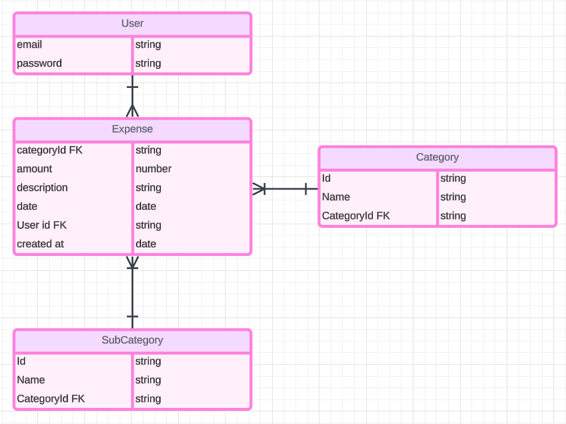

💰 Expense Tracker
============

I have always been terrible at keeping track of money and my expenses. So for this final project I decided to develop an app that would help me keep track of my expenses and hopfully help me improve on my spending habits. 

### [Start tracking your expenses](https://react-expense-tracker-8544ae5cd5ba.herokuapp.com/)

📝 App Overview
============
Expense Tracker is developed using React, JS, CSS, React Authentication and Bulma CSS.

💻 Technologies Used
==============

📸 Screenshots
==============
### Wireframe

### ERD

### Mid-Development

### Deployed

💻 Trello Link
==============

### [Trello Board](https://trello.com/b/deDDCTF1/capstone-project)

⏭️ Next Steps
============
- [ ] Optimize for different screens (mobiles/tablets).
- [ ] Ability to search expenses from a search bar.
- [ ] Ability to connect bank account to better keep track of the money.
- [ ] Create graph/pie chart to see a realtime visuals of the expense.

Acknowledgments
============

Special Thanks to Ashley for helping me debug when I was stuck on multiple instances
